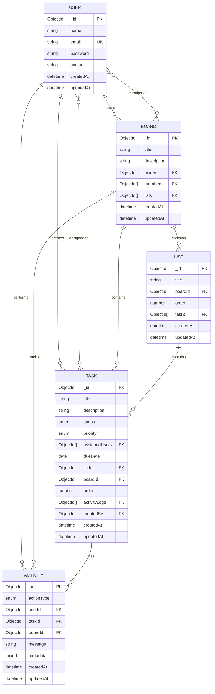

# Database Schema

This document describes the MongoDB database schema design for the TaskCollab platform, including all collections, fields, relationships, and indexes.

## Collections Overview

The database consists of 5 main collections:
1. **users** - User accounts and authentication
2. **boards** - Project boards
3. **lists** - Kanban columns within boards
4. **tasks** - Individual task items
5. **activities** - Activity logs for tasks

## Entity Relationship Diagram



## Schema Definitions

### User Collection

```javascript
{
  _id: ObjectId,
  name: String (required, trimmed),
  email: String (required, unique, lowercase, validated),
  password: String (required, bcrypt hashed, min 6 chars, select: false),
  avatar: String (default: placeholder URL),
  createdAt: DateTime (auto),
  updatedAt: DateTime (auto)
}
```

**Indexes:**
- `email`: Unique index for fast login lookups

**Validation:**
- Email format validated with regex
- Password hashed with bcrypt before storage (never stored plain)

**Security:**
- Password field has `select: false` to prevent accidental exposure

---

### Board Collection

```javascript
{
  _id: ObjectId,
  title: String (required, trimmed, max 100 chars),
  description: String (trimmed, max 500 chars),
  owner: ObjectId (ref: 'User', required),
  members: [ObjectId] (ref: 'User'),
  lists: [ObjectId] (ref: 'List'),
  createdAt: DateTime (auto),
  updatedAt: DateTime (auto)
}
```

**Indexes:**
- `owner`: For querying user's owned boards
- `members`: For querying boards where user is a member

**Relationships:**
- One-to-many with User (owner)
- Many-to-many with User (members)
- One-to-many with List

**Cascade Behavior:**
- Deleting a board deletes all its lists and tasks

---

### List Collection

```javascript
{
  _id: ObjectId,
  title: String (required, trimmed, max 100 chars),
  boardId: ObjectId (ref: 'Board', required),
  order: Number (default: 0),
  tasks: [ObjectId] (ref: 'Task'),
  createdAt: DateTime (auto),
  updatedAt: DateTime (auto)
}
```

**Indexes:**
- `boardId`: For efficient board-level queries
- Compound index: `{ boardId: 1, order: 1 }` for sorted retrieval

**Relationships:**
- Many-to-one with Board
- One-to-many with Task

**Ordering:**
- `order` field maintains list sequence within a board
- Updated when lists are reordered

**Cascade Behavior:**
- Deleting a list deletes all its tasks

---

### Task Collection

```javascript
{
  _id: ObjectId,
  title: String (required, trimmed, max 200 chars),
  description: String (trimmed),
  status: String (enum: ['todo', 'in-progress', 'done'], default: 'todo'),
  priority: String (enum: ['low', 'medium', 'high', 'urgent'], default: 'medium'),
  assignedUsers: [ObjectId] (ref: 'User'),
  dueDate: Date (optional),
  listId: ObjectId (ref: 'List', required),
  boardId: ObjectId (ref: 'Board', required),
  order: Number (default: 0),
  activityLogs: [ObjectId] (ref: 'Activity'),
  createdBy: ObjectId (ref: 'User', required),
  createdAt: DateTime (auto),
  updatedAt: DateTime (auto)
}
```

**Indexes:**
- `listId`: Fast retrieval of tasks in a list
- `boardId`: Board-level task queries
- Compound: `{ listId: 1, order: 1 }` for sorted tasks
- Text index: `title` for search functionality

**Relationships:**
- Many-to-one with List
- Many-to-one with Board
- Many-to-many with User (assignedUsers)
- One-to-one with User (createdBy)
- One-to-many with Activity

**Enums:**
- Status: `todo`, `in-progress`, `done`
- Priority: `low`, `medium`, `high`, `urgent`

**Ordering:**
- `order` field maintains task position within a list
- Recalculated on drag-and-drop

---

### Activity Collection

```javascript
{
  _id: ObjectId,
  actionType: String (required, enum: [
    'task_created', 'task_updated', 'task_moved',
    'task_deleted', 'user_assigned', 'user_unassigned',
    'priority_changed', 'duedate_changed',
    'description_updated', 'title_updated'
  ]),
  userId: ObjectId (ref: 'User', required),
  taskId: ObjectId (ref: 'Task', required),
  boardId: ObjectId (ref: 'Board', required),
  message: String (required),
  metadata: Mixed (optional, stores additional context),
  createdAt: DateTime (auto),
  updatedAt: DateTime (auto)
}
```

**Indexes:**
- `taskId`: Fast retrieval of task activity timeline
- `boardId`: Board-level activity feed
- `createdAt`: Chronological sorting

**Relationships:**
- Many-to-one with User (who performed the action)
- Many-to-one with Task
- Many-to-one with Board

**Action Types:**
All possible activity types are enumerated to maintain consistency

**Metadata Field:**
Stores additional context like:
- Previous and new values for updates
- Source and destination list IDs for moves

---

## Data Integrity

### Referential Integrity

MongoDB doesn't enforce foreign key constraints, so we handle integrity in application code:

1. **On Board Deletion:**
   - Find all lists in the board
   - Delete all tasks in those lists
   - Delete all lists
   - Delete the board

2. **On List Deletion:**
   - Delete all tasks in the list
   - Remove list reference from board
   - Delete the list

3. **On Task Deletion:**
   - Remove task reference from list
   - Keep activity logs (optional: can be deleted)

### Validation Rules

| Field | Rule |
|-------|------|
| Board.title | Required, max 100 chars |
| List.title | Required, max 100 chars |
| Task.title | Required, max 200 chars |
| User.email | Required, unique, valid email format |
| User.password | Required, min 6 chars, hashed |

## Query Patterns

### Common Queries

**Get all boards for a user:**
```javascript
Board.find({
  $or: [
    { owner: userId },
    { members: userId }
  ]
})
```

**Get board with all data (populated):**
```javascript
Board.findById(boardId)
  .populate('owner', 'name email avatar')
  .populate('members', 'name email avatar')
  .populate({
    path: 'lists',
    populate: {
      path: 'tasks',
      populate: [
        { path: 'assignedUsers' },
        { path: 'createdBy' }
      ]
    }
  })
```

**Search tasks:**
```javascript
Task.find({
  boardId: boardId,
  title: { $regex: searchTerm, $options: 'i' }
})
.populate('assignedUsers')
.sort({ createdAt: -1 })
.limit(50)
```

**Get task activity:**
```javascript
Activity.find({ taskId: taskId })
  .populate('userId', 'name email avatar')
  .sort({ createdAt: -1 })
```

## Performance Considerations

### Indexes Strategy

**Critical Indexes (must have):**
- `users.email` - Unique, for authentication
- `boards.owner` - Frequent user board queries
- `lists.boardId` - Essential for board rendering
- `tasks.listId` - Most common task query
- `tasks.boardId` - Board-level operations
- `activities.taskId` - Activity timeline

**Optional Indexes (nice to have):**
- `tasks.title` (text) - For search functionality
- `tasks.assignedUsers` - For filtering by assignee
- `boards.members` - For member-based queries

### Embedded vs Referenced

**Current Approach: Referenced**
- Better for large datasets
- Easier to update individual entities
- Supports many-to-many relationships

**Alternative: Embedded**
Could embed tasks within lists for faster initial load:
```javascript
{
  _id: ObjectId,
  title: "To Do",
  tasks: [
    { title: "Task 1", ... },
    { title: "Task 2", ... }
  ]
}
```

**Trade-offs:**
- ✅ Faster initial load
- ❌ Document size limits (16MB)
- ❌ Harder to query individual tasks
- ❌ Real-time updates more complex

**Decision:** Stay with references for scalability

### Data Size Estimates

Assuming 1000 users, 500 boards, 2000 lists, 10,000 tasks:

| Collection | Docs | Avg Size | Total |
|-----------|------|----------|-------|
| users | 1,000 | 200 bytes | 200 KB |
| boards | 500 | 300 bytes | 150 KB |
| lists | 2,000 | 200 bytes | 400 KB |
| tasks | 10,000 | 500 bytes | 5 MB |
| activities | 50,000 | 250 bytes | 12.5 MB |
| **Total** | | | **~18 MB** |

Well within MongoDB's capabilities. Even at 100x scale (1M tasks), still manageable.

## Migration Strategy

### Future Schema Changes

If we need to add fields:

1. **Add with defaults:**
   ```javascript
   tags: {
     type: [String],
     default: []
   }
   ```

2. **Migration script:**
   ```javascript
   db.tasks.updateMany(
     { tags: { $exists: false } },
     { $set: { tags: [] } }
   )
   ```

3. **Versioning:**
   Consider adding `schemaVersion` field for major changes

### Backup Strategy

- **Automated daily backups** (MongoDB Atlas)
- **Point-in-time recovery** capability
- **Pre-deployment snapshots** before migrations

---

This schema design balances flexibility, performance, and data integrity while supporting all required features of the collaboration platform.
